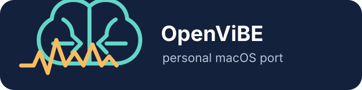

# OpenViBE macOS Port

  

This is my personal effort to run OpenViBE 3.2.0 on macOS. I am keeping the
macOS configuration, source patches, and packaging scripts here so that I can
rebuild the application and track the changes in one place.

The large upstream source trees, local build directories, dependency files,
and generated `.app` bundles are deliberately left out of Git. They can be
recreated with the scripts in this repository.

## License

The OpenViBE source components used here (SDK, Designer, and Extras) are
licensed under the GNU Affero General Public License, version 3 (AGPLv3).
When you obtain or redistribute OpenViBE, please keep the upstream copyright
notices and `COPYING` files. If binaries are distributed, the corresponding
source and these porting changes must be made available as required by the
license. Some dependencies have their own licenses, so check their notices as
well. Unless a file says otherwise, the original porting scripts and
configuration in this repository are intended to be distributed under AGPLv3
as part of the port.

The official project is hosted by [OpenViBE at Inria](https://gitlab.inria.fr/openvibe).
Its [meta repository](https://github.com/dioptre/openvibe) describes the SDK,
Designer, and Extras split and the submodule-based build layout.

## Local build

1. Get the matching OpenViBE 3.2.0 source trees and place them in `work/`, or
   let the setup script download the upstream repository with
   `--download-sources`.
2. Run `script/setup_macos.sh --download-sources --install-deps` from the
   repository root. The
   script checks the source layout, creates the required links, builds Designer,
   and launches the packaged app.

Use `script/setup_macos.sh --check-only` to validate a machine without building.

The script builds Designer, packages its framework and resources into an app
bundle, installs the launcher and icon, and applies an ad-hoc signature so the
bundle can be run locally. The resulting applications are written to
`outputs/`.

## Known limitations

Designer and the included test generators are the working part of this port.
The Acquisition Server is currently experimental and should not be considered
ready for real hardware. Driver support still needs to be added, and there are
remaining connection, packaging, and runtime issues to fix before it can be
used reliably with EEG amplifiers. The acquisition-server packaging script is
kept here to make that work easier to continue.

## Included scripts

- `script/build_and_run.sh` — configure, build, package, and launch Designer
- `script/package_acquisition_server.sh` — package Acquisition Server
- `script/Info.plist` and launcher sources — app metadata and launchers

## Contributors

- **Arda Arslanbakan** — project direction, macOS testing, and release
  integration.
- **OpenAI Codex** — coding assistance, porting work, build automation, and
  troubleshooting support.
- **OpenViBE contributors** — upstream project and original application.

This is a personal macOS port and is not an official OpenViBE release. It is
provided for experimentation and development, and may still need additional
work for other Macs or newer macOS versions.
